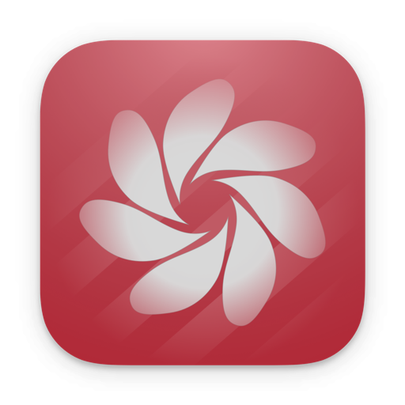

<!--idoc:ignore:start-->
> [!TIP]
> Declaration: This project is not an open-source project. The repository serves as the official website, used to collect issues and user demands. This is done to save costs, because without an official website, the application cannot pass the review.
<!--idoc:ignore:end-->

   
   
  
  <h1>
    Vidwall
  </h1>
  <!--rehype:style=border: 0;-->
  

    <a href="./README.zh.md">简体中文</a> • 
    <a target="_blank" href="https://github.com/jaywcjlove/vidwall/issues/new?template=bug_report.yml">Contact & Support</a> • 
    <a href="./CHANGELOG.md">Changelog</a>
  

  

    
  

Set stunning 4K videos as your dynamic desktop wallpaper — supports MP4 and MOV formats. Simply drag and drop a video into the app and apply it with a single click.

Bring your desktop to life with animated wallpapers! Perfect for adding visual flair to your workspace or recording videos with an eye-catching background.