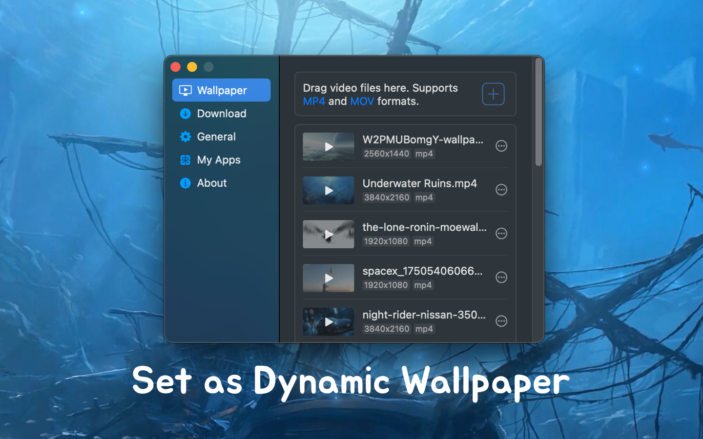
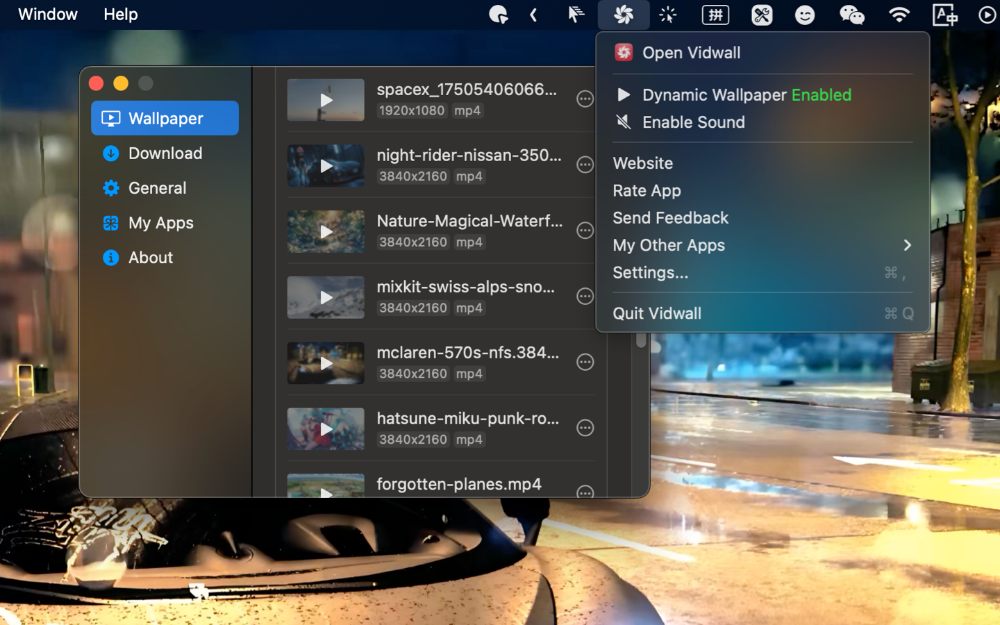

<!--idoc:ignore:start-->
> [!TIP]
> 声明：此项目并非开源项目，仓库作为官方网站，用于收集问题和用户需求。这样做是为了节省成本，因为没有官网，应用无法通过审核。
<!--idoc:ignore:end-->

   
   
  
  <h1>
    Vidwall
  </h1>
  <!--rehype:style=border: 0;-->
  

    <a href="./README.md">English</a> • 
    <a target="_blank" href="https://github.com/jaywcjlove/vidwall/issues/new?template=bug_report_cn.yml">联系&支持</a> • 
    <a href="./CHANGELOG.zh.md">更新日志</a>
  

  

    
  

支持将 4K 视频设置为动态桌面壁纸，兼容 MP4 和 MOV 格式。只需将视频拖入应用界面，点击即可立即应用为桌面背景。

为桌面增添生动趣味的动态壁纸效果！录制视频时设置动态背景，也能让画面更吸引人。

<!--idoc:config:
title: Vidwall
keywords: 动态壁纸,视频壁纸,桌面壁纸,4K,MP4,MOV,Video Wallpaper,Dynamic Wallpaper,Desktop Wallpaper,4K Video,桌面美化,视频桌面,Vidwall
description: 支持将 4K 视频设置为动态桌面壁纸，兼容 MP4 和 MOV 格式。
-->